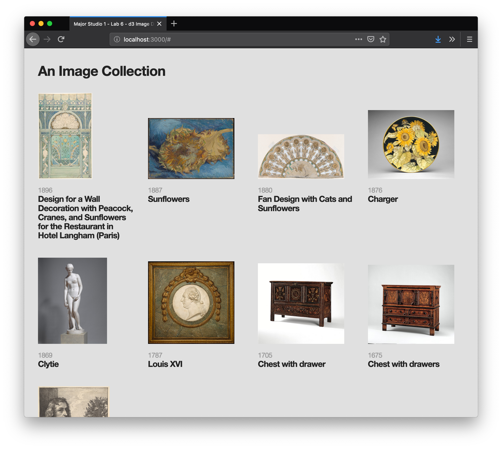

# display images with d3.js

---

this example code:
1. fetches our `data.json`
2. sorts our data by object date
3. uses d3 to create a `div` for each object and populate it with an image, object date, and title

the resulting HTML is styled with CSS

---

`app.js` has comments explaining each step and `app.min.js` is a cleaner filer without comments.
