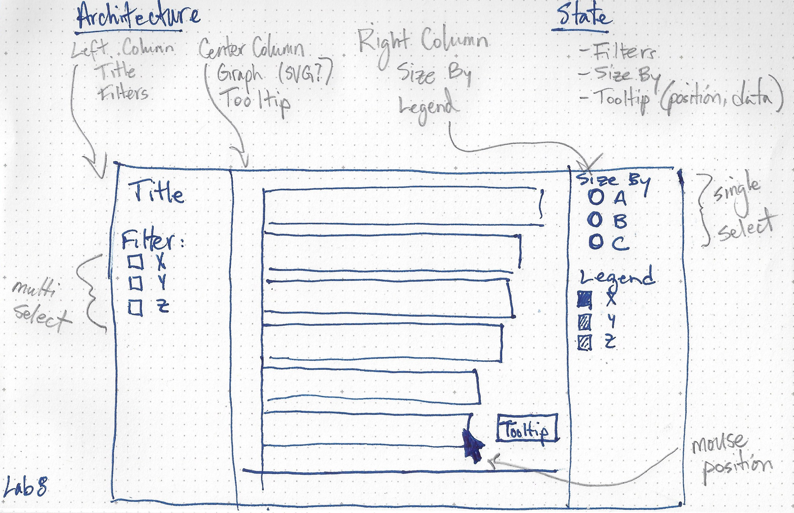

## Lab 8: Interactivity

This lab demonstrates filter, select, and hover behavior with a simple D3 visualization. This also shows how to use a `state` variable to keep track of your data.

### App Architecture + State Schema

### Activity

- 10 minutes: read through the code. Try to focus on the order in which code is _executed_, not necessarily the order in which it is written.

- 15 minutes: discussion and questions about the code

- 15 minutes: add new features together

### To-Do List

- [ ] Use destructuring to get variables off state
- [ ] Add transitions on enter/exit
- [ ] Add a window.resize event listener
- [ ] Add CSS to style tooltip and menus

### JS Resources

- Memoization: https://codeburst.io/understanding-memoization-in-3-minutes-2e58daf33a19

- Immutability: https://www.sitepoint.com/immutability-javascript/
